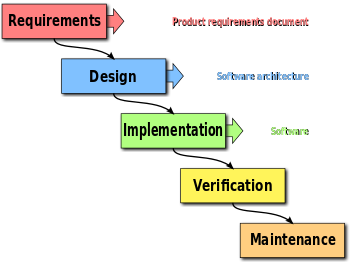

# 목표
> 자바스크립트 개념을 빠르고 심도 있게 가져가자

## 🔄 애자일 방법론 (Agile)
기존의 소프트웨어 개발 모델인 폭포수 모델과 비교되는 개발 방식으로 사이클을  
<h3 style="display: inline">작고</h3>, <h3 style="display: inline">빠르게</h3>, <h3 style="display: inline">여러 번</h3> 가져가면서 소프트웨어 개발하는 방식입니다.
 

## 1️⃣ 작고
챕터별로 가져가기보다 개념을 작게 나눠 개념을 같이 살펴봤습니다. 

👉🏼  길어질 수 있는 혼자만의 공부 시간을 최소화하여 루즈해지는 것을 예방

## 2️⃣ 빠르게
개념을 꼼꼼하게 살펴보되 둘 중 한명이라도 이해가 어려운 개념은 <h3 style="display: inline">10분</h3> 을 넘기지 않고 다시 사이클을 반복할 때 살펴보거나 멘토분들의 도움을 얻었습니다. 

👉🏼 개념을 보다가 우주로 가는 것을 방지

## 3️⃣ 여러 번
사이클을 반복하면서 이해가 어려웠던 부분은 다시 살펴볼 수 있었습니다. 
👉🏼 여러 번 반복하면서 이해의 깊이가 깊어짐

## 🧐 결론
소프트웨어 개발 방식을 접목하여 개념 공부를 하는 것이 낯설었지만 함께하는 페어가 서로에게 많은 것을 배울 수 있는 시간이었습니다.
