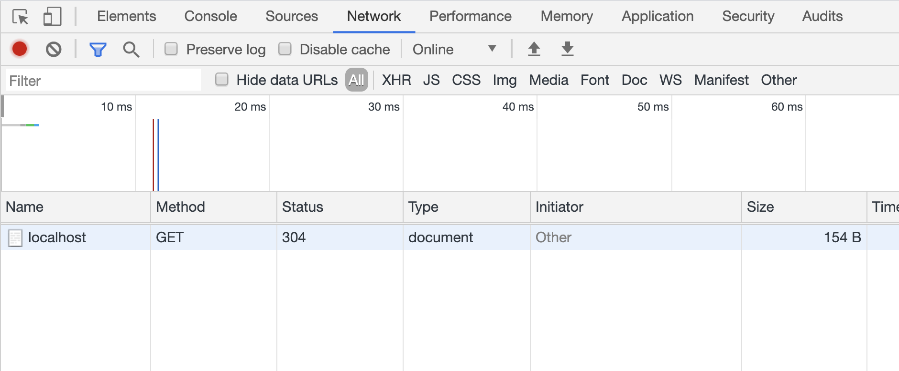

# Node Basics

여러분의 컴퓨터에 Node.js가 설치되어 있다면 어디에서든 아래와 같은 내용의 파일을 만들고 `node <파일경로>/<파일이름>.js` 형식의 명령어를 이용해 서버를 실행시킬 수 있습니다.

```js
const http = require("http");

function requestHandler(req, res) {
  res.end("Hello World");
}

// 서버 생성 후, 8080번 포트를 이용하여 실행.
http.createServer(requestHandler).listen(8080);

console.log("Server running at http://127.0.0.1:8080/");
```

## HTTP 요청 (HTTP Request)

이제 브라우저에서 `localhost:8080` 혹은 `127.0.0.1:8080`을 통해 서버에 접속해보세요. `Hello World`라는 글씨가 보이나요?

현재 크게 두 가지 일이 발생했습니다.

1. 브라우저(혹은 클라이언트)가 `http://localhost:8080` 주소의 서버로 자료를 요청했습니다.
2. 서버에서는 `Hello World`라는 텍스트 자료를 응답으로 브라우저에게 내보냈습니다.

> 클라이언트란, 서버에 저장된 정보를 실사용자들이 소비할 수 있게끔 연결해주는 프로그램을 뜻합니다. 대표적으로 브라우저, iOS 앱, Android 앱 등이 있습니다.

브라우저에서 접속했다는 의미는 GET 요청이 해당 주소로 전송되었음을 의미합니다. HTTP 네트워크 요청에는 대표적으로 아래와 같이 네 가지가 있습니다.

1. POST: 서버에 데이터를 생성해달라고 요청할때 사용 i.e. 사용자 정보 새로 만들기 혹은 회원가입
2. GET: 서버에 데이터를 찾아달라고 요청할때 사용 i.e. 사용자 정보 가져오기
3. PUT: 서버에 데이터를 수정해달라고 요청할때 사용 i.e. 기존 사용자 이름 수정하기
4. DELETE: 서버에 데이터를 삭제해달라고 요청할때 사용 i.e. 기존 사용자 탈퇴 처리

더 많은 요청 메소드가 있습니다. 아래 자료를 한번 훑어보고 넘어가세요.

- [HTTP 메소드](https://blog.sonim1.com/95)

개발자 도구의 네트워크 탭에서 아래와 같이 `http://localhost:8080/`라는 주소로 **GET** 요청이 나갔다는 정보를 확인할 수 있습니다.



## HTTP 응답 (HTTP Response)

방금 위 이미지를 보면 **Status**라는 컬럼이 존재합니다.

우리가 서버에 자료를 요청하게 되면, 서버는 요청을 처리하고 응답을 해주어야 합니다. 그리고 응답을 해줄때는 반드시 응답 코드가 포함되어야 합니다. 물론 상세 내용이 필요하기도 하겠지만, 간단한 응답 코드를 통해 어떤 카테고리의 응답인지를 표현해주어야 합니다. 응답 코드에는 굉장히 많은 종류가 있습니다. 모두 외울 필요는 없지만, 아래 나열된 정보는 알고 계시면 좋을것 같습니다.

_모든 응답코드는 3자리 숫자입니다._

- 1XX: 정보응답 (여러분이 알지 못하셔도 괜찮습니다.)
- 2XX: 성공응답
- 3XX: Redirection 응답 (다른 곳으로 보내는 것을 의미합니다.)
- 4XX: 클라이언트 에러 응답
- 5XX: 서버 에러 응답

_전체 응답 코드 목록도 한번 훑어보세요._

- [HTTP 응답 코드 - MDN](https://developer.mozilla.org/ko/docs/Web/HTTP/Status)

## Summary

서버와 클라이언트의 관계는 우리가 음식을 주문하는 상황과 비교해 생각해보세요.

- 손님이 주문 요청을 하면 식당에는 주문서가 들어갑니다.
- 식당에서는 주문서 내용에 따라 음식을 만들어 손님에게 서빙합니다.
- 식당 측이 바쁠 경우, 주문을 취소할 수도 있습니다.
- 식당 측이 문을 닫았을 경우, 주문 자체가 들어가지 못할 수도 있습니다.
- 손님 측이 주문 실수를 했을 경우도 있을 수 있습니다.

HTTP 요청과 응답, 그리고 클라이언트와 서버는 위와 같다고 기억해 놓으시면 조금 더 쉽지 않을까 합니다.

## Download

서버의 요청과 응답을 쉽게 테스트하기 위해서 POSTMAN이라는 도구가 굉장히 유용합니다.

- [POSTMAN](https://www.postman.com/)

## Reference

- [Node.js Doc](https://nodejs.org/api/)

## TODO: 요청 처리하기

Spec 1에 대한 테스트(`/spec/01-node-basics.js`)를 참고하여 다음과 같이 작동하도록 `app.js`를 수정해주세요.

### TODO #1

- [ ] `/` URL로 `GET` 요청이 들어왔을때, `/static/index.html` 파일을 응답(200 status)으로 보내주세요.

### TODO #2, 3

- [ ] `/static/index.html`의 리소스 파일(CSS, JS 등)을 활성화 시킨 후, 이 파일들에 대한 요청 또한 처리해주세요.

### TODO #4

- [ ] 위 상황을 제외한 모든 요청에 대해서는 `Hello, World` 텍스트를 응답(200 status)으로 보내주세요.

### Check!

- 위 작업을 모두 완료하였다면, 서버를 실행하고 브라우저에서 `http://localhost:8080`을 확인해보세요.
