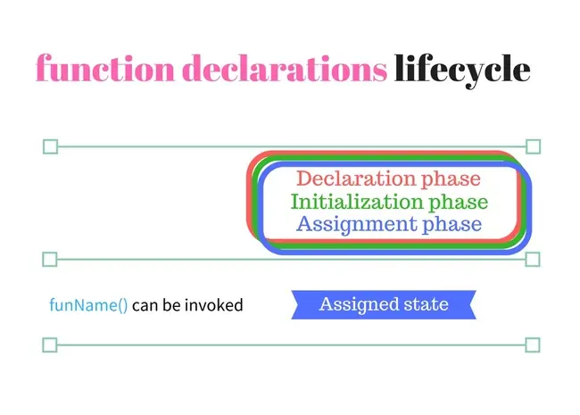
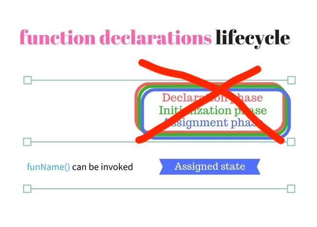

# 📍 함수 

## 📌 함수 선언식 vs 함수 표현식
### 1️⃣ 구조
- <span style="color: #4B45D6">함수 선언식</span>
  ```jsx
    function whereAmI(){
      return 'vaco';
    }

    whereAmI() // 'vaco'
  ```


- <span style="color: #D03C45">함수 표현식<span>
  ```jsx
  const whereAmI = function(){
    return 'vaco';
  }

  whereAmI() // 'vaco'
  ```

### 2️⃣ 동작원리
- <span style="color: #4B45D6">함수 선언식</span>

  

  👉🏼 함수 선언식은 선언 하자마자 선언 및 초기화와 할당이 **동시에** 이루어 진다.

- <span style="color: #D03C45">함수 표현식</span>

  

  👉🏼 함수 표현식은 함수 변수에 할당 되는 것이므로 함수의 선언 및 초기화는 **변수**의 방식을 따릅니다.

## 📌 화살표 함수(_arrow function_)
ECMAScript 6에서 도입된 문법으로 `function` 키워드 대신에 화살표를 사용해서 조금 더 **간략해진** 방법입니다.
### 1️⃣ 구조
  ```jsx
  const whereAmI = () =>{
    return 'vaco';
  }
  ```
### 2️⃣ 과연 구조만 간략해졌을까요???
화살표 함수에서는 구조 뿐만 아니라 **내부 동작**도 간략화 되었습니다.

1. 화살표 함수는 인스턴스를 생성할 수 없는 non-constructor 다.

2. 중복된 매개변수 이름을 선언 할 수 없다.

3. 화살표 함수는 함수 자체에 `this`,`arguments`,`super`,`new.target` 바인딩을 갖지 않습니다.

### 3️⃣ 우리는 우주로 가지 않기 위해 우선 this 바인딩에 집중하기로 했습니다. 🚀
- 정의
  * `this` : 자신이 속한 <span style="font-weight: bold">객체</span>를 <span style="font-weight: bold">가리키는</span> 식별자 입니다.

  * `binding` : 식별자와 값을 연결하는 과정 입니다.

- 예시
    ```jsx
      let obj = {
        place: 'vaco',
        whereAmI(){
          return this.place; 
        }
      }

      obj.whereAmI() // 'vaco'
    ```
  👉🏼  `whereAmI()` 함수 안에 `this` 는 함수 자신이 속한 객체 (`obj`) 를 가리킵니다.

### 4️⃣ 그렇다면 `this` 는 무조건 자신이 속한 객체만을 가리키나요???
`this` 바인딩은 함수 호출 방식에 따라 `this` 가 가리키는 객체를 동적으로 결정 할 수 있습니다.
1. 일반함수 호출
    ```jsx
    function whereAmI(){
      console.log(`this is ${this}`); //'this is [object global]
    }
    ```
   👉🏼 일반 함수로 호출 할 경우 기본적으로 `this`는 window 인 전역객체를 가리킵니다.

2. 메서드 호출

    👉🏼 위 예시와 같이 그 메소드를 호출 한 객체`obj` 를 가리킵니다

3. 생성자 함수 호출
    ```jsx
    function Vaco(who){
      this.who = 'friends';
    }

    const suBo = new Vaco('subo')

    console.log(suBo.who) // 'friends'
    ```
    👉🏼 생성자 함수가 생성할 객체(`suBo`)(instance)를 가리킨다.

4. `apply()` `call()`
    ```jsx
    function whereAmI(a,b){
      this.place = a + b;
    }

    let obj = {
      place:'home'
    };

    console.log(obj); // { place:'home'}

    whereAmI.apply(obj,['va','co']);

    console.log(obj); // { place:'vaco'}

    whereAmI.call(obj,'ho','me');
    
    console.log(obj); // { place:'home'}
    ```
    👉🏼 `apply()` `call()`은 함수에서 this가 첫번째 인수인 객체를 가리키도록 동작합니다.


### 5️⃣ 그래서? (결론)
위에서 살펴본 this 바인딩이 화살표 함수는 없다는 의미는 결국... <h3 style="color: teal;"> 화살표 함수는 this를 동적으로 결정할 수 없다는 의미입니다. </h3>
